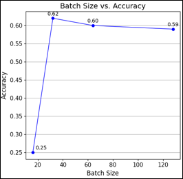
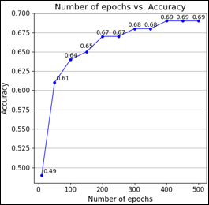
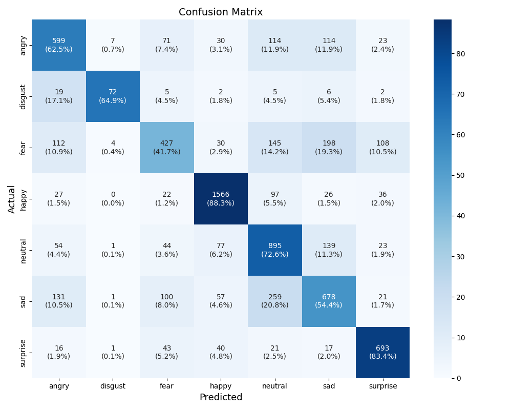

# facial-expression-recognition-cnn
Custom CNN for facial expression recognition on FER2013, achieving 69% accuracy across 7 emotion classes with a Tkinter desktop  app for real-time predictions.
# Facial Expression Recognition using Convolutional Neural Network

A custom CNN model that classifies facial expressions into 7 categories (Angry, Disgust, Fear, Happy, Neutral, Sad, Surprise), trained on the FER2013 dataset, with a desktop GUI application built using Tkinter.

This project is based on a published research paper — see docs/EKST_paper.pdf

## Overview

- **Dataset:** FER2013 (35,887 grayscale 48x48 images, 28,709 train / 7,178 test)
- **Architecture:** Custom 13-layer CNN — 4 convolutional layers, 3 max-pooling layers, 3 dropout layers, 1 flatten layer, 2 dense layers
- **Best result:** 69% test accuracy (batch size 32, 400 epochs, learning rate 0.0001)
- **Application:** Tkinter GUI for uploading an image and viewing the predicted expression with a percentage breakdown

## Model Architecture

| Layer | Type | Output Shape |
|---|---|---|
| Conv2d_1 | Convolutional | (46, 46, 32) |
| Conv2d_2 | Convolutional | (44, 44, 64) |
| Maxpooling2d_1 | Pooling | (22, 22, 64) |
| Dropout_1 | Dropout | (22, 22, 64) |
| Conv2d_3 | Convolutional | (20, 20, 128) |
| Maxpooling2d_2 | Pooling | (10, 10, 128) |
| Conv2d_4 | Convolutional | (8, 8, 128) |
| Maxpooling2d_3 | Pooling | (4, 4, 128) |
| Dropout_2 | Dropout | (4, 4, 128) |
| Flatten_1 | Flatten | (2048) |
| Dense_1 | Dense | (1024) |
| Dropout_3 | Dropout | (1024) |
| Dense_2 | Dense | (7) |

## Results

### Hyperparameter Tuning — Batch Size

Tested batch sizes 16, 32, 64, 128 (learning rate 0.0001, 50 epochs fixed).



Accuracy peaked at **batch size 32 (62%)**, then declined slightly at larger batch sizes. Training time consistently decreases as batch size increases.

### Hyperparameter Tuning — Epochs

Tested epochs from 10 to 500 (batch size 32, learning rate 0.0001 fixed).



Accuracy plateaued at **400 epochs (69%)** — further training showed no improvement.

### Confusion Matrix



- Best performing class: **Happy** (88.3% true positive rate)
- Worst performing class: **Fear** (41.7% true positive rate) — frequently confused with Sad and Neutral

### Application Demo


Users can upload an image, view the predicted expression with confidence percentage and prediction time, and see a full percentage breakdown across all 7 expressions.

## Repository Structure

```
├── src/
│   ├── train.py              # Model architecture + training loop
│   ├── test.py                # Model evaluation + confusion matrix
│   ├── result_batch_size.py   # Batch size vs accuracy/time plots
│   └── result_epochs.py       # Epochs vs accuracy/time plots
├── app/
│   └── app.py                 # Tkinter GUI application
├── results/                   # Generated plots and screenshots
├── docs/
│   └── EKST_paper.pdf         # Published research paper
└── requirements.txt
```

## Setup

```bash
pip install -r requirements.txt
```

Download the FER2013 dataset from [Kaggle](https://www.kaggle.com/datasets/msambare/fer2013) and place it as:
```
data/train/
data/test/
```

## Usage

**Train the model:**
```bash
python src/train.py
```

**Evaluate the trained model:**
```bash
python src/test.py
```

**Run the GUI application:**
```bash
python app/app.py
```

Note: the pretrained model file (`emotion_recognition_model32-400.keras`) is not included in this repo due to file size. [Add your download link here if hosted externally, e.g. Google Drive/HuggingFace.]

## Key Findings

- CNN architecture outperforms traditional ML approaches (SVM, random forests) for facial expression recognition
- Batch size of 32 offers the best accuracy-efficiency tradeoff
- Model accuracy plateaus after 400 training epochs
- The "Fear" expression remains the hardest class to classify accurately — likely due to visual overlap with Sad and Neutral, and possible class imbalance in the training data

## Future Improvements

- Increase training data for underperforming classes (particularly Fear)
- Explore transfer learning with pretrained models (e.g. VGG, ResNet)
- Address class imbalance in the FER2013 dataset

## Citation

Pang Kou Yi, Lee Siaw Chong, "Facial Expression Recognition Application Using Convolutional Neural Network," Enhanced Knowledge in Sciences and Technology (EKST), Universiti Tun Hussein Onn Malaysia.

## Author

Pang Kou Yi — Department of Mathematics and Statistics, Faculty of Applied Sciences and Technology, UTHM
